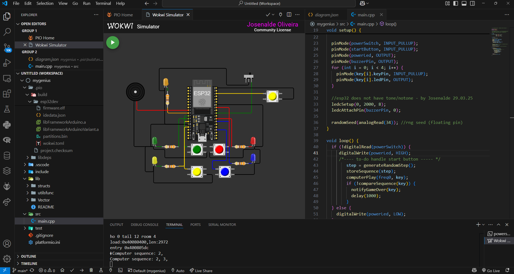
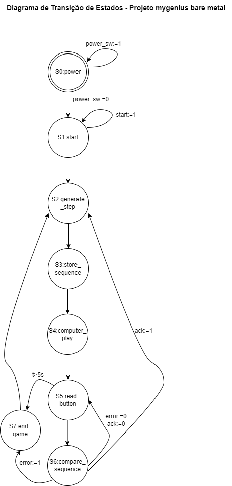

# bare-metal-mygenius
a platformio-based bare metal genius game with button timing, hability levels - wokwi simulation
an example of project design@graduate program in mechatronics - UFRN under may classes on flux-project of embedded systems
See the print below, with wokwi simulator and platformIO extensions. All you need integrated into VSCODE
</img>

## 1) after installing the extensions, build the project
## 2) copy wokwi.toml and diagram.json to build root folder or other, getting the relative path of firmware.elf and .bin to wokwi.toml
## 3) click diagram.json and wokwi asks for a licence. Follow the instructions

The drawio extension is also important for drawing UML diagrams and transition states diagrams, as it follows below:
</img>

